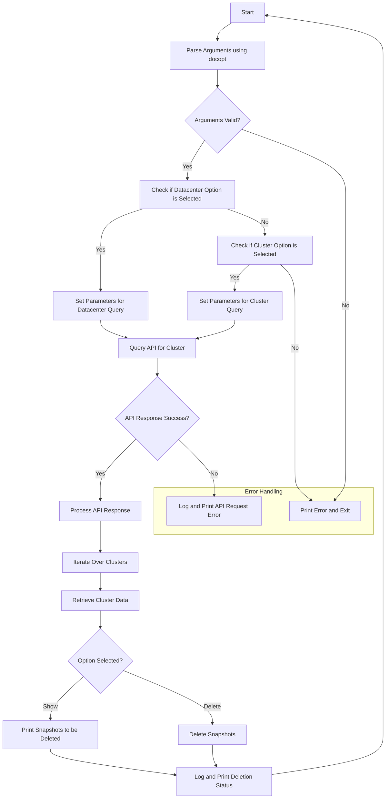

# ClusterSnapManager
A tool for handling snapshot operations on data center clusters, including viewing and deleting snapshots.


### Features
- The script can query cluster data from a specified datacenter or an individual cluster from grafana.
- The script includes functionality for managing snapshots within clusters, specifically `showing` and `deleting` snapshots.
- `Logs` all important action and the name of the user
- Helpful CLI

### Requirements
- Python 3.6 or higher
- ONTAP 9 (NetApp storage system) or higher (untested on earlier versions)
- Install docopt
- Install requests
- Install pyyaml
- Install prettytable
- Install python-dateutil
- Install pandas
- Install numpy

```bassh
    pip install requests docopt pyyaml prettytable python-dateutil pandas numpy

```
Check [install docopt](https://pypi.org/project/docopt/) for more information


### Usage Example
## Run the program


1. To get all cluster data from a datacenter and show snapshots:

```bash
get_cluster.py [datacenter] --datacenter --opt=show [my_user]

```  		
2. To get all cluster data from a datacenter and delete snapshots:

```bash
get_cluster.py [datacenter] --datacenter --opt=delete [my_user]

```  	
3. To get data from a specific cluster and show snapshots:

```bash
get_cluster.py [my_cluster] --cluster --opt=show [my_user]


```  
4. To get data from a specific cluster and delete snapshots:

```bash
get_cluster.py [my_cluster] --cluster --opt=delete [my_user]

```  
5. HELP
```
create_vol.py -h | --help
```

- [my_cluster] => cluster name
- [datacenter] => datacenter name
- [my_user] => name of user running the script


##FLOWCHART


